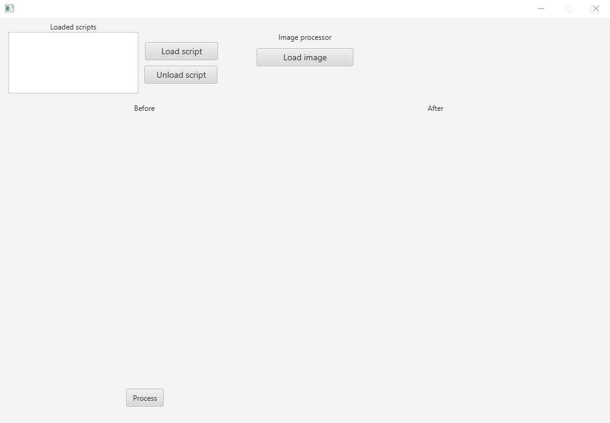
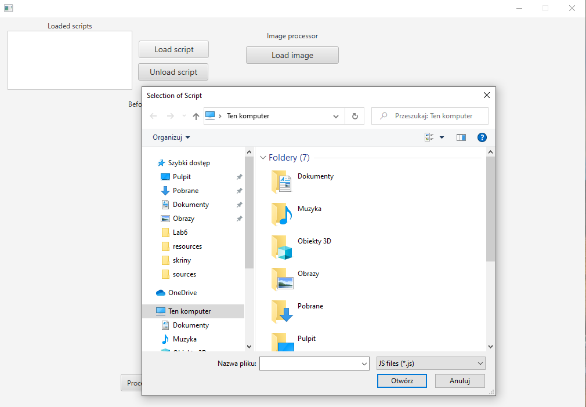
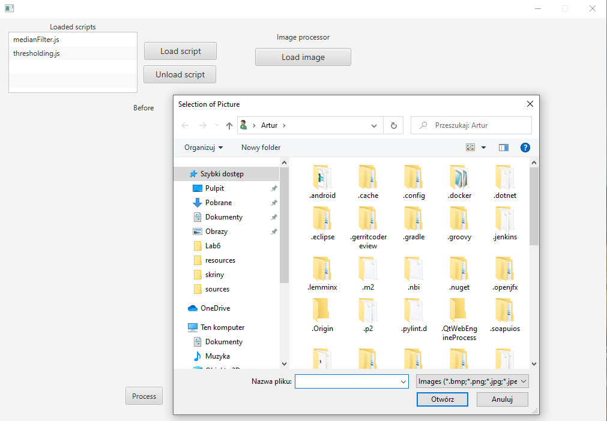
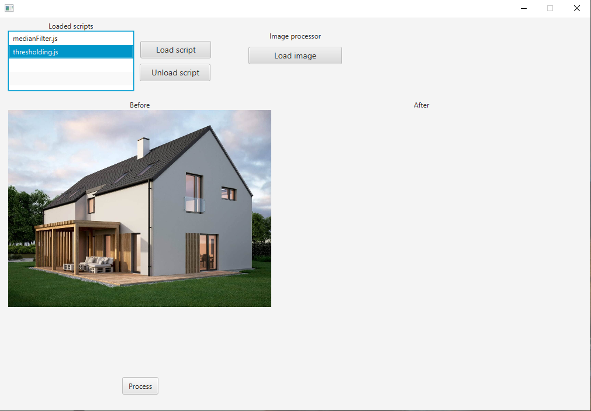
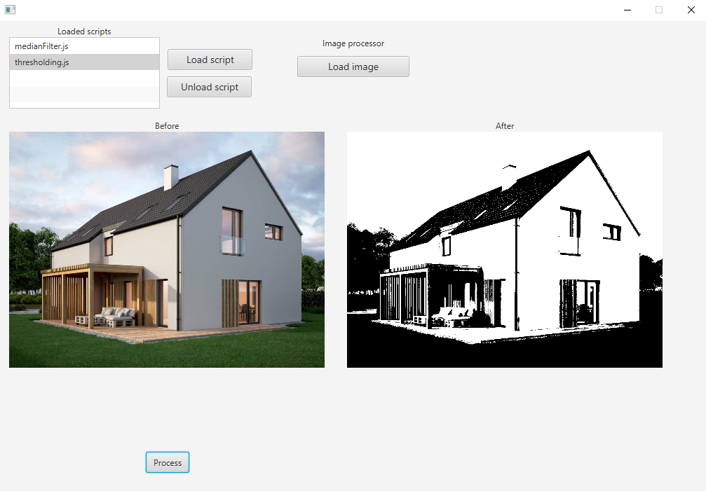
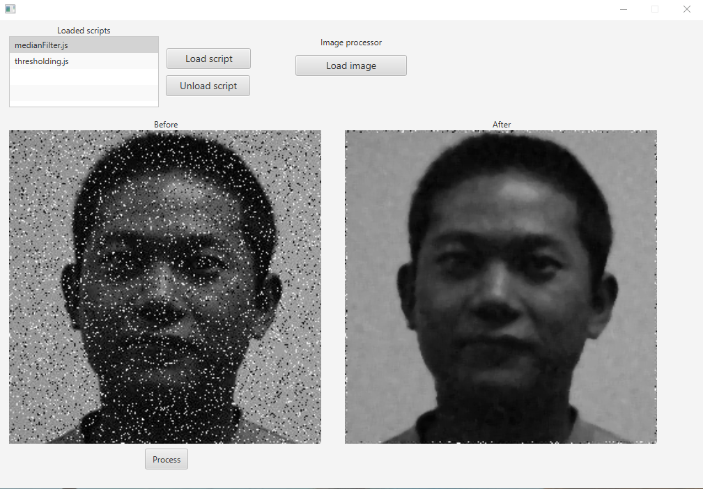

# Java + JavaScript

## 1. Okno główne aplikacji

## 2. Załadowanie skryptu
Po kliknięciu w przycisk "Load script" wyświetla się okno wyboru pliku z rozszrzeniem "js".
Po wybraniu skryptu wyświetli się na liście.

## 3. Załadowanie obrazka
Kliknięcie w przycisk "Load image" otworzy okno wyboru obrazka. Po załadowaniu obrazka powinien się on pojawić pod etykietą "Before".

## 4. Wybór skryptu do przetworzenia obrazka
Po wyborze skryptu należy kliknąć przycisk "Process" aby rozpocząć przetwarzanie.

## 5. Przetwarzanie filtrem progowym

## 6. Przetwarzanie filtrem medianowym
